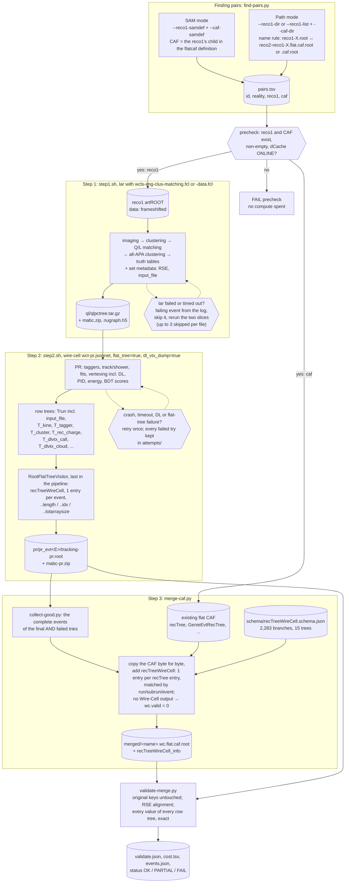

# Issue 39: merge Wire-Cell `tracking-pr.root` into the flat CAF

GitHub: https://github.com/HaiwangYu/wire-cell-toolkit-ai-helper/issues/39.

**Status (2026-10-08): validated on FNAL sbndbuild03** on 5 gen2 CV pairs: `recTreeWireCell` in every merged CAF is identical to its `tracking-pr.root` (68 / 68 events, 1.06 M values), and the cost of each step is recorded (log (b)). Not yet run on Aurora (needs the owner's login); `sbnd-wirecell-production/aurora/AGENTS.md` has the deployment steps.

**Ask (Haiwang, 2026-10-08).** For large-scale production, put the Wire-Cell standalone output (`tracking-pr.root`) into the commonly used flat CAF as a new tree, `recTreeWireCell`.
- **Task 1:** analyse an existing flat CAF: how `recTree` handles jagged content, and how it maps to `GenieEvtRecTree`.
- **Task 2:** make every `tracking-pr.root` tree per event, and carry metadata (the input artROOT path) from step 1 through `qlpctree.tar.gz`.
- **Task 3:** a 3-step workflow (reco1 → `qlpctree.tar.gz` → `tracking-pr.root` → merged CAF), with inputs found by SAM definition or path.
- **Validation:** `recTreeWireCell` identical to `tracking-pr.root`, and the cost of every step recorded.
- Steering scripts and agent instructions go in `HaiwangYu/sbnd-wirecell-production`, folder `aurora/`.

Builds on #33 (our 2-step chain), #35 (the DL dump) and #38 (production run r7 and its harness).

## Test inputs

Five reco1 / flat-CAF pairs from the gen2 CV production, `aurora_SBND2026A_gen2_BNBLight_prodgenie_corsika_proton_rockbox0p1_sbnd_CV_v10_14_02_03_{reco1,flatcaf}_sbnd`.
- The FNAL copies are under `/pnfs/sbn/data_add/sbn_nd/aurora/mc/v10_14_02_03/prodgenie_corsika_proton_rockbox0p1_sbnd/Gen2_2026/CV/{reco1,caf}/000000/000000/`. Aurora's `Gen2_2026/` holds the same production; there the CAFs are named `*.caf.root` rather than `*.flat.caf.root`.
- Staged on sbndbuild03 in `production-prep/caf-merge-dev/inputs/{reco1,caf}/`.

| id | reco1 | flat CAF | events |
|---|---|---|---|
| `f33e-e536-780d-5a11` (the example) | `reco1-detsim-g4-gen-Gen2_2026-<id>.root` | `reco2-reco1-detsim-g4-gen-Gen2_2026-<id>.flat.caf.root` | 15 |
| `0045-7b83-3292-4b82` | 〃 | 〃 | |
| `00a3-5b88-5b98-db94` | 〃 | 〃 | |
| `00d8-4843-8a75-5672` | 〃 | 〃 | |
| `0100-7286-fc4e-3030` | 〃 | 〃 | |

SAM lineage: the flat CAF's parent is the reco1 file itself, and both have the same event count (15 for `f33e`, events 1–44). So `recTree` has one entry per reco1 art event.

## Task 1: the flat CAF format

The file holds `recTree` (15 entries), `GenieEvtRecTree` (27), `globalTree` (1), the histograms `TotalPOT`, `TotalEvents`, `TotalGenEvents`, and the directories `env/` and `metadata/`. `recTree` has 2,662 branches. They come from the CAF `StandardRecord` flattened by SRProxy, all under `rec.`.

### How `recTree` stores jagged content

**One entry = one art event.** Every level of the nested `StandardRecord` is flattened into C arrays inside that one entry:

| level | example | stored as |
|---|---|---|
| per event | `rec.hdr.run` (UInt_t), `rec.nslc` (Int_t) | a scalar |
| vector in the event (slices) | `rec.slc.vertex.x` | `Float_t[rec.slc..length]`; `rec.slc..length` (Int_t) is the number of slices in this event |
| vector inside a vector (PFPs of each slice) | `rec.slc.reco.pfp.trk.len` | ONE flat array per event, `Float_t[rec.slc.reco.pfp..totarraysize]`, holding the PFPs of all slices back to back |
| its bookkeeping | `rec.slc.reco.pfp..length[rec.slc..length]`, `rec.slc.reco.pfp..idx[rec.slc..length]` | per slice: how many PFPs, and where they start in the flat array |

So the PFPs of slice *i* are `flat[idx[i] : idx[i] + length[i]]`. Deeper levels repeat the pattern: a `..length` / `..idx` pair per parent element, and one flat array sized by a scalar `..totarraysize` branch. The file has 143 `..length`, 109 `..idx` and 109 `..totarraysize` branches.

Example, `f33e` entry 0 (run 301, subrun 55, event 1): 8 slices; `rec.slc.reco.npfp` = `[3, 2, 8, 6, 3, 9, 2, 3]`; `pfp..idx` = `[0, 3, 5, 13, 19, 22, 31, 33]`; the flat `pfp.trk.len` has 36 values.

This is ROOT's variable-length array mechanism: a leaf `x[n]` whose size `n` is another scalar leaf of the same entry. Nesting is resolved by flattening and keeping offsets. It needs no `vector<vector<>>` dictionaries, and `uproot` / `awkward` read it directly as jagged arrays.

### `recTree` vs `GenieEvtRecTree`

- **`GenieEvtRecTree` has one entry per simulated neutrino interaction**, the GENIE `GHepRecord`s (`GenieEvtRec.*`, plus `GENIEEntry` and `SourceFileHash`). An event can hold several: the gen2 CV sample overlays the beam neutrino with rockbox / dirt interactions. In `f33e`, 15 events hold 27 interactions.
- **`recTree` has one entry per event.** Its truth block is `rec.mc.nu[rec.mc.nu..length]`; `rec.mc.nnu` is the same count.
- **The link is `rec.mc.nu.genie_evtrec_idx`:** the entry number in `GenieEvtRecTree` of that neutrino. For `f33e`, event 1 has `genie_evtrec_idx = [0, 1]` with E = 0.682, 1.839 GeV, and GENIE entries 0 and 1 carry exactly those energies. Event 3 has `[2, 3]`, event 4 has `[4]`, and so on. The sum of `rec.mc.nnu` over the file is 27, equal to `GenieEvtRecTree`'s entry count.
- **Reco objects point at truth by index too.** `rec.slc.tmatch.index[rec.slc..length]` is the index into `rec.mc.nu` of the slice's matched neutrino, or -999.

### What this means for `recTreeWireCell`

Follow the same convention: one entry per art event, aligned with `recTree` by run / subrun / event.
- A `tracking-pr.root` tree with N rows per event becomes arrays sized by `wc.<tree>..length`.
- A per-row vector becomes `..length` / `..idx` / `..totarraysize` plus a flat array.
- `vector<vector<>>` gets one more level of the same.
- Cross-references keep the existing index columns (`nu_index`, `cluster_id`, `call_index`, …), just as CAF uses `tmatch.index`.

### What `tracking-pr.root` holds (r7, one file per event)

| tree | rows per event | branch types |
|---|---|---|
| `Trun` | 1 | Int_t, Double_t, string (6) |
| `T_kine`, `T_tagger` | one per neutrino candidate | Float_t, Int_t, vector<float>, vector<int> |
| `T_bundle` | one per flash bundle | Int_t, Float_t |
| `T_cluster` | one per cluster | Int_t, Double_t |
| `T_flash` | one per flash | Int_t, Float_t |
| `T_segment` | one per PR segment | Int_t, Float_t |
| `T_rec_charge` | one per fitted point | Int_t, Double_t |
| `T_bad_ch` | one per bad-channel range | Int_t |
| `T_proj_data` | 1 | vector<int>, vector<vector<int>> |
| `T_proj` | 1 | none |
| `T_truth_nu`, `T_truth_pf` (MC) | one per neutrino / truth particle | Int_t, Double_t |
| `T_dlvtx_call` | one per DL network call | Int_t, Double_t, vector<float/int/double> |
| `T_dlvtx_cloud` | one per network-input point | Int_t, Float_t |

There are only eight value types in all: Int_t, Float_t, Double_t, string, vector<int>, vector<float>, vector<double>, vector<vector<int>>. So a generic, exact conversion is possible.

## Design

- **Step 1 (larwirecell).** The WCT art module forwards art's `respondToOpenInputFile(FileBlock)` to the visitors. `wclsTruthInformationAttacher` stamps `input_file` (the art input path, `FileBlock::fileName()`) into the set metadata, next to the RSE, so it travels in `qlpctree.tar.gz`. No fcl or driver change is needed.
- **Step 2 (toolkit).**
  - The PR MABC exposes its input set metadata to the visitors.
  - `SbndPrMagnifyTrackingVisitor` writes `Trun.input_file`.
  - A new visitor runs last in the PR pipeline. It reads back the per-event `tracking-pr.root` and writes `recTreeWireCell`: 1 entry, every tree in the CAF flat layout above, plus `wc.run` / `wc.subrun` / `wc.evt`.
  - It is a `pr()` knob, default off, so every compiled config stays byte-identical until switched on. The row trees stay in the file, for existing tools and for validation.
- **Step 3 (production repo).** The merger copies the flat CAF unchanged and adds `recTreeWireCell`.
  - Its entries follow `recTree`'s order, matched by run / subrun / event.
  - An event without Wire-Cell output (crashed or not run) gets an empty entry with `wc.valid = 0`.
  - Pairs are found by SAM definition (`samweb`, the CAF's parent is the reco1) or by path, from the name mapping `reco1-X.root` ↔ `reco2-reco1-X.{flat.,}caf.root`.

## Workflow

Scripts in `HaiwangYu/sbnd-wirecell-production`, folder `aurora/bin/`.
- `run-pairs.sh` drives the whole chain: one `run_pair.py` per pair, up to the site's concurrency limit.
- Each step runs inside the SL7 container under `timeout -k 60`, and is timed into `<pair>/cost.tsv`.
- The hexagons and dashed arrows are the exception handling of log (c).

## Log

- 2026-10-08: scope; Task 1 analysis (above); 5 test pairs staged; issue #39 opened.

### (a) 2026-10-08: M1–M3 implemented

**M1, larwirecell** (`HaiwangYu/larwirecell` branch `sbnd-wc-flatcaf`, `3b54651` from `189ad26`; pushed):
- `IArtEventVisitor` and `MainTool` gain `respond_to_open_input_file(filename)`, a no-op by default.
- The WCT art module overrides `SharedProducer::respondToOpenInputFile(FileBlock)`, and the `WCLS` tool forwards `FileBlock::fileName()` to every inputer and outputer.
- `wclsTruthInformationAttacher` stamps it as set metadata `input_file` (key `file_key`; `""` disables it) next to the RSE. So `qlpctree.tar.gz` carries it, with no fcl or driver change.
- **Build:** `MAKE_RC=0`. Four libs changed and were deployed: the module, the tool, `libWireCellLarsoft`, and `libWireCellAIML` (whose labeler implements the changed interface). Backup in `lib-backup-189ad26-20261008`.
- **Check:** a 2-event step 1 on `f33e`: each event's set metadata has `input_file` = the reco1 path.

**M2, toolkit** (`HaiwangYu/wire-cell-toolkit` branch `sbnd-wc-flatcaf` from master `b7bd2a1a`; local commits `c062d017`, `f6fd2209`):
- `Facade::Ensemble::input_metadata()`: the input set metadata, published by `MultiAlgBlobClustering` for its visitors.
- `SbndPrMagnifyTrackingVisitor` writes `Trun.input_file` (string) when the input carries it. It is absent otherwise, so older inputs keep the schema.
- **New `RootFlatTreeVisitor`** (`root/`): runs last in the PR pipeline, reopens the per-event `tracking-pr.root`, and appends `recTreeWireCell` with ONE entry.
  - It holds every tree in the flat-CAF layout: `wc.<T>..length` rows; scalars as `[wc.<T>..length]`; vectors and strings as `..length`/`..idx`/`..totarraysize` plus a flat array; `vector<vector>` with a `.v` level. Types are kept, and an unsupported type is an error.
  - Doctest `doctest_root_flat_tree`: 54 / 54 (scalars, a string, `vector<float>` with an empty row, `vector<vector<int>>`, a 0-row tree). `wcdoctest-root` 12 / 12.
- **cfg:** `pr()` entry `flat_tree`; `sbnd-pr-stage` `flat_tree=false`; `wct-pr.jsonnet` TLA `flat_tree=false`.
  - Config proof (`cfg-proof.py`): all 43 checks pass. With the knob off, all 8 SBND jobs are byte-identical to master.
  - With `flat_tree=true`, step 2 (sim and data) gains exactly `RootFlatTreeVisitor:pr`, last in the `clus_pr` pipeline after `UbooneTaggerOutputVisitor:pr`.
- **Bug fixed on the way:** `write_empty_proj_data` (events without projection data) booked `T_proj_data.charge/charge_err/charge_pred` as `vector<vector<double>>`, while a normal event has `vector<vector<int>>`. One tree had two types depending on the event, which a fixed schema cannot hold. Now `int`, as the normal path. (Worth upstreaming.)
- **Build:** incremental `wcb install`, `BUILD_RC=0`, RPATH re-stripped.

**M3, the workflow** (`HaiwangYu/sbnd-wirecell-production`, folder `aurora/`):

| file | role |
|---|---|
| `bin/find-pairs.py` | pairs by SAM (`--reco1-samdef` + `--caf-samdef`: the CAF is the reco1's child; a reco1 has several CAF-like children, so the flatcaf definition is required) or by path (name rule `reco1-X.root` ↔ `reco2-reco1-X.{flat.,}caf.root`); `--path-map` rewrites `/pnfs` to a mirror |
| `bin/step1.sh`, `bin/step2.sh` | the two Wire-Cell steps, inside SL7; step 2 refuses to run without the DL modules and fails if `dl_fail` > 0 or a flat tree is missing |
| `bin/merge-caf.py` | step 3 (PyROOT only): copy the CAF, add `recTreeWireCell` aligned with `recTree` by RSE, fixed schema, `valid=0` entries for events without Wire-Cell output, hard errors on schema mismatch |
| `bin/validate-merge.py` | original CAF keys untouched; alignment; every value of every row tree reproduced exactly; empty entries empty |
| `bin/make-schema.py`, `schema/recTreeWireCell.schema.json` | the fixed schema: 2,283 branches, 15 trees, built from an MC event with a candidate (2 events of `f33e`) and 20 beam-on events; data adds no branch |
| `bin/run-pair.sh`, `bin/run-pairs.sh`, `bin/cost-summary.py` | the driver: per pair, steps 1–3 and validation with `/usr/bin/time -v` cost; a pool with the day/night limit, memory guards and a Kerberos wait; step 2 retried once |
| `site/{fnal-sbndbuild03,aurora}.sh`, `env/{fnal,aurora}/`, `pbs/run-pairs.pbs` | sites; the Aurora environment is a copy of #29's scripts |
| `README.md`, `AGENTS.md` | for people and for agents (rules, gates G1–G5, traps) |

**Checks so far:**
- The 2-event merge into the 15-event `f33e` CAF passes validation: 31,506 values in 1,023 rows of 30 trees exact, 13 entries empty with `valid = 0`, and all original CAF keys unchanged.
- **Negative tests, both caught:** a row tree deleted from a `tracking-pr.root`; a single integer changed by +1 (`T_bad_ch.chid`, row 0), found as "`wc.T_bad_ch.chid` differs".
- `find-pairs.py` finds the 5 test pairs by path, and in SAM mode the first 3 pairs of the CV definitions with their `/pnfs` locations and event counts.

### (b) 2026-10-08: validation on 5 pairs, and the cost of each step

`bin/run-pairs.sh site/fnal-sbndbuild03.sh pairs-path.tsv run5` ran the 5 test pairs through steps 1–3 plus validation. Work dir: `production-prep/caf-merge-dev/run5/`.
- **Software:** toolkit `sbnd-wc-flatcaf` `f6fd2209`, larwirecell `sbnd-wc-flatcaf` `3b54651`, wcp-porting-validation `main`, schema md5 `c845fe94fbe5`.
- **Outcome:** all 5 pairs `OK`; no step-2 retry was needed.

| pair | CAF events | merged events | rows compared | values compared | validation |
|---|---|---|---|---|---|
| `0045-7b83-3292-4b82` | 11 | 11 | 4,761 | 132,947 | PASS |
| `00a3-5b88-5b98-db94` | 16 | 16 | 7,342 | 209,415 | PASS |
| `00d8-4843-8a75-5672` | 17 | 17 | 13,505 | 476,417 | PASS |
| `0100-7286-fc4e-3030` | 9 | 9 | 2,871 | 66,858 | PASS |
| `f33e-e536-780d-5a11` | 15 | 15 | 6,265 | 176,526 | PASS |
| **total** | **68** | **68** | **34,744** | **1,062,163** | **0 problems** |

What "PASS" checks (`validate-merge.py`):
- **(A)** Every key of the original CAF is in the merged file with the same name, cycle, class, object length and compressed size, so the original data is untouched. The new keys are exactly `recTreeWireCell` and `recTreeWireCell_info`.
- **(B)** `recTreeWireCell` has one entry per `recTree` entry, with the same run / subrun / event, in order.
- **(C)** For each event, every row tree of `tracking-pr.root` is reproduced: the row count, and every value of every branch of every row. That covers scalars with their type, vectors and strings through `..idx` / `..length`, and `vector<vector>` through `.v`; NaN = NaN.
- **(D)** Events without Wire-Cell output have `valid = 0` and 0 rows.
- **Negative tests:** a deleted row tree, and one integer changed by +1, both make it FAIL (log (a)).

**Usability:** `uproot` reads the merged CAF directly. `recTreeWireCell` and `recTree` align event by event, and e.g. `wc.T_kine.kine_reco_Enu` and `wc.T_dlvtx_call.truth_reco_x` come out as jagged arrays per candidate / call.

**Cost** (`run5/cost-summary.md` and per pair `cost.tsv`; one process per pair and step, pinned to cores 32–63, sbndbuild03):

| step | what | wall / event | CPU / event | max RSS (median / max) | output / event |
|---|---|---|---|---|---|
| 1 | reco1 → `qlpctree.tar.gz` (`lar`, imaging to all-APA clustering) | 24.0 s | 23.6 s | 1.66 / 1.69 GB | 8.9 MB (tar 1.8, Bee 5.2, nugraph.h5 1.3, …) |
| 2 | tar → `tracking-pr.root` + `recTreeWireCell` (PR, DL vertex with the dump) | 3.5 s | 3.0 s | 1.41 / 1.52 GB | 0.66 MB (incl. step-2 Bee) |
| 3 | merge into the flat CAF | 0.18 s | 0.16 s | 0.58 GB | +51.5 kB to the CAF (53.9 → 57.4 MB, +6.5 %) |
| check | validation | 0.42 s | 0.41 s | 0.72 / 0.80 GB | – |

- Per pair (one reco1 file, 9–17 events): step 1 takes 3.5–7 min, step 2 25–85 s, step 3 2–3 s.
- Step 2 here is BNB CV. nueCC is ~6× more CPU per event in step 2 (19 s, #38).
- **Inside `tracking-pr.root`, the one-entry `recTreeWireCell` takes 75 kB / event against 46 kB for the row trees,** because each of its 2,283 branches has its own basket. In the merged CAF, with entries in one tree, it is 51.5 kB / event. The visitor's `drop_row_trees: true` would drop the duplication, at the cost of the row trees the existing tools read.

**Next:**
- run on Aurora (`AGENTS.md`, "Deploying on Aurora"): build the two `sbnd-wc-flatcaf` branches there, then the 5-pair smoke via `pbs/run-pairs.pbs`;
- upstream the `T_proj_data` type fix;
- the owner's call on `drop_row_trees` for production.

### (c) 2026-10-09: exception handling, and the 5-pair validation rerun

**Haiwang's request:** implement the five fixes for missing CAFs, missing step-1 output and crashed jobs, then rerun the validation; use up to 60 % of sbndbuild03, which is idle.

**New per-pair driver:** `bin/run_pair.py` replaces `run-pair.sh`. It is a host-side Python script; every step still runs in the container.

| fix | what it does |
|---|---|
| 1. CAF precheck | before any compute, the reco1 and the CAF must exist and be non-empty, and a `/pnfs` file must be `ONLINE` / `ONLINE_AND_NEARLINE` (dCache locality; a tape-only file would block a copy indefinitely, #26). Otherwise `FAIL precheck <what> <why>` |
| 2. timeouts | every step runs under `timeout -k 60`: step 1 `900 + 300 × events` s, step 2 `600 + 300 × events` s, merge 1800 s, validation 3600 s (`WC_TIMEOUT_*`) |
| 3. partial merge | if a tar's step 2 fails every try, `collect-good.py` gathers the complete per-event files of the final AND failed tries and those are merged; the other CAF events get `wc.valid = 0`. A file counts as complete when it has a one-entry `recTreeWireCell`, written last, so crash stubs never pass |
| 4. step-1 slicing | when `lar` fails or times out, the event it was on is found from the last `<OpHitSource:tpc0> run R subrun S event E` line of `lar.log` (art's "Begin processing" message is off in our fcl). That event is skipped and the slice rerun as two (`--nskip` / `-n`), recursively, up to `WC_STEP1_MAX_BAD` = 3 per file; each slice then has its own step 2 |
| 5. failed tries kept | every failed try moves to `<pair>/attempts/<step>-<tag>-try<k>/`, numbered across reruns, never deleted; `cost.tsv` has one row per try; `cost-summary.md` lists them separately |

- **Status:** `OK` (every CAF event has Wire-Cell output), `PARTIAL` (merged and validated, some events without Wire-Cell output; `events.json` says which and why), or `FAIL <stage> <why>`.
- **Resume:** reruns skip `OK` / `PARTIAL` pairs (`WC_RETRY_PARTIAL=1` reruns `PARTIAL`), and a pair reuses every step-1 slice and step-2 tar with a `DONE` marker.

**Validation rerun** (`caf-merge-dev/run6/`, cores 26–63 and up to 75 GB, 60 % of the node): the 5 pairs plus a sixth read straight from `/pnfs` (`0000-0eb3-c6ab-90e8`, from the SAM pair list, so the locality check runs on real dCache files).

| pair | status | CAF / merged events | rows | values | validation |
|---|---|---|---|---|---|
| `0000-0eb3-c6ab-90e8` (`/pnfs`) | OK | 14 / 14 | 11,885 | 419,524 | PASS |
| `0045-7b83-3292-4b82` | OK | 11 / 11 | 4,761 | 132,947 | PASS |
| `00a3-5b88-5b98-db94` | OK | 16 / 16 | 7,342 | 209,415 | PASS |
| `00d8-4843-8a75-5672` | OK | 17 / 17 | 13,505 | 476,417 | PASS |
| `0100-7286-fc4e-3030` | OK | 9 / 9 | 2,871 | 66,858 | PASS |
| `f33e-e536-780d-5a11` | OK | 15 / 15 | 6,265 | 176,526 | PASS |
| **total** | **6 OK** | **82 / 82** | **46,629** | **1,481,687** | **0 problems** |

The five original pairs give the same row and value counts as log (b).

| step | wall / event | CPU / event | max RSS (median / max) | output / event |
|---|---|---|---|---|
| 1 | 26.7 s | 24.2 s | 1.67 / 1.68 GB | 8.7 MB |
| 2 | 3.9 s | 3.2 s | 1.42 / 1.53 GB | 0.71 MB |
| 3 (merge) | 0.21 s | 0.16 s | 0.57 GB | +55 kB to the CAF |
| validation | 0.48 s | 0.47 s | 0.75 / 0.85 GB | – |

**Exception tests:** each fix exercised by a real failure; work dirs `caf-merge-dev/exc/`, `exc-timeout/`.

| test | what was done | result |
|---|---|---|
| T1 missing CAF | a pair whose CAF path does not exist | `FAIL precheck caf missing or empty: …`, in under a second, no compute |
| T2 step-1 crash | the file with the deterministic crash, run 471 / subrun 18 / event 33 (`reco1-…-67a3-4e42-52e3-19f7`, 14 events, from `/pnfs`) | `lar` rc 139 after 228 s. The failing event was found as index 7 = (471, 18, 33), the same position #26 recorded. It was skipped and slices `s0-7` and `s8-14` ran cleanly. Merged **13 / 14** with event 33 at `valid = 0`, validation PASS (214,382 values), status **PARTIAL**, `events.json` records the skip; the crashed try is kept in `attempts/step1-all-try1` |
| T3 step-2 crash, as a timeout | `f33e` with step-2 time limit 30 s (needs ~47 s) | both tries killed (rc 124), both kept (`attempts/step2-all-try1`, `-try2`). Each had 8 complete events plus 1 stub, which was correctly excluded. Merged **8 / 15**, the rest `valid = 0`, validation PASS (97,100 values), status **PARTIAL** |
| T3 resume | rerun with normal limits and `WC_RETRY_PARTIAL=1` | step 1 reused (no new step-1 row), step 2 succeeded, **OK 15 / 15**, validation PASS (176,526 values); the two failed tries are still there |

**Limitation found:** a try killed by its timeout reports ~0 CPU and ~10 MB RSS in `cost.tsv`. The killed `wire-cell` or `lar` is a grandchild that is never reaped, so `/usr/bin/time` cannot see it. Its wall time is right; successful runs are unaffected.

**Commits:** `sbnd-wirecell-production` `5f66e46` (`run_pair.py`, `collect-good.py`, `count-events.py`, `run-pairs.sh`, `cost-summary.py`, README / AGENTS); this doc, with the diagram updated for the precheck, slicing and partial merge.
